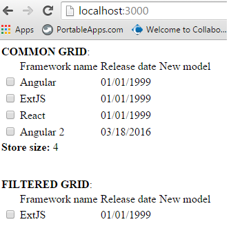
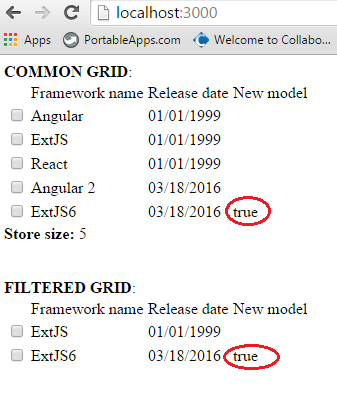

# Angular2 Filtered Store

This is a fork from [Angular2 Webpack Starter](https://github.com/AngularClass/angular2-webpack-starter) project.

### How to start

1. npm install
2. npm start
3. http://localhost:3000

### Usage example

##### Common grid
```
@Component(new FrameworkGridComponent())
export class FrameworkGrid extends DefaultFrameworkGrid<FrameworkStore> {

    protected storeSize:boolean = true;

    constructor(protected store:FrameworkStore, protected editable:Editable) {
        super(store, editable);
    }
}
```

##### Filtered grid
```
class FrameworkFilteredPredicate implements IPredicate<FrameworkModel> {

    public apply(machine:FrameworkModel):boolean {
        return machine.getName().indexOf('Ext') > -1;
    }
}

const FRAMEWORK_FILTERED_PREDICATE:IPredicate<FrameworkModel> = new FrameworkFilteredPredicate();

@Component(new FrameworkFilteredGridComponent())
export class FrameworkFilteredGrid extends DefaultFrameworkGrid<FrameworkStore> {

    protected filterPredicate:IPredicate<FrameworkModel> = FRAMEWORK_FILTERED_PREDICATE;

    constructor(protected store:FrameworkStore, protected editable:Editable) {
        super(store, editable);
    }
}
```

##### Usage
```
  constructor(protected frameworkStore:FrameworkStore, protected dataProvider:DataProvider, protected proxyWriter:ProxyWriter) {

    frameworkStore.setProxyWriter(proxyWriter);

    this.dataProvider.getFrameworks().then((models:Array<FrameworkModel>) => {

      this.frameworkStore.addAll(new ArrayList<FrameworkModel>(models));
      this.makeModel("Angular 2");

      setTimeout(() => {
        this.makeModel("ExtJS6");
      }, 4000);
    });
  }

  private makeModel(frameworkName) {
    let framework:FrameworkModel = new FrameworkModel(frameworkName, new Date());
    framework.phantom(true);

    this.frameworkStore.add(framework);
    this.frameworkStore.save();
  }
```

##### Template
```
<table>
	<tr>
		<td *ngFor="#col of columns">{{col.getDescription()}}</td>
	</tr>
  <tr *ngFor="#model of store | FilterPipe:filterPredicate" (click)="onRowClick($event, model)">
		<td *ngFor="#col of columns" [ngSwitch]="col.getColumnType()" (click)="onClick($event, col, model)">
			<div *ngSwitchWhen="'checkbox'">
				<input type="checkbox" checked="{{col.getModelValue(model)}}" (change)="onModifyModel($event, col, model)"/>
			</div>
			<div *ngSwitchDefault>
				{{col.getModelValue(model)}}
			</div>
		</td>
	</tr>
</table>
<div *ngIf="storeSize"><b>Store size:</b> {{store.getSize()}}</div>
```

### An example of the work program

##### State #1


##### State #2


##### State #3


##### State #4


##### State #5


### Sources

##### Api logic
[Common package](src/common)

##### App logic
[View](src/app/home/view)
[Model](src/app/home/model)
[Data](src/app/home/data)